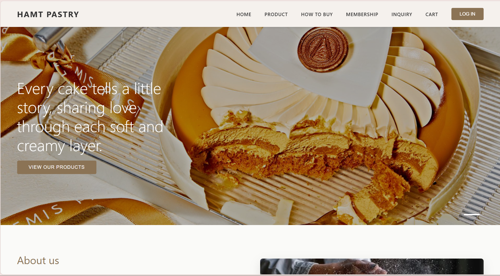

# Portfolio Website - Hướng dẫn sử dụng

## 📁 Cấu trúc thư mục

```
portfolio/
├── index.html          # File HTML chính
├── css/
│   └── styles.css      # File CSS styling
├── js/
│   └── script.js       # File JavaScript
└── assets/
    ├── images/         # Thư mục chứa hình ảnh
    │   └── README.md   # Hướng dẫn về ảnh
    └── README.md       # Hướng dẫn về assets
```

## 🎨 Tính năng

- ✅ Thiết kế responsive (mobile-friendly)
- ✅ Navigation menu với hiệu ứng smooth scroll
- ✅ Hero section với ảnh đại diện
- ✅ About section với thông tin cá nhân
- ✅ Skills section với progress bars
- ✅ Projects section với 6 dự án mẫu
- ✅ Contact section với form liên hệ
- ✅ Social media links
- ✅ Scroll to top button
- ✅ Animations và hover effects

## 📝 Cách tùy chỉnh

### 1. Thông tin cá nhân (index.html)

Tìm và thay thế các placeholder sau:

- `[Tên của bạn]` - Tên đầy đủ của bạn
- `[Tên đầy đủ của bạn]` - Tên trong phần About
- `your.email@example.com` - Email của bạn
- `[Thành phố của bạn]` - Địa chỉ của bạn
- `[Trường đại học của bạn]` - Học vấn
- `yourusername` - Username mạng xã hội (GitHub, LinkedIn, Facebook, Instagram)
- `+84 xxx xxx xxx` - Số điện thoại

### 2. Thêm ảnh (assets/images/)

Thêm các file ảnh sau vào thư mục `assets/images/`:

- `profile.jpg` - Ảnh đại diện (400x400px)
- `about.jpg` - Ảnh phần giới thiệu
- `project1.jpg` đến `project6.jpg` - Ảnh các dự án (800x600px)

**Lưu ý:** Bạn có thể sử dụng ảnh placeholder tạm thời bằng cách thay đổi src trong HTML:
```html

```

### 3. Tùy chỉnh màu sắc (css/styles.css)

Thay đổi các biến CSS trong `:root`:

```css
:root {
    --primary-color: #6366f1;      /* Màu chính */
    --secondary-color: #8b5cf6;    /* Màu phụ */
    --accent-color: #ec4899;       /* Màu nhấn */
}
```

### 4. Chỉnh sửa kỹ năng

Trong file `index.html`, tìm phần Skills và chỉnh sửa:

```html
<div class="skill-item">
    <div class="skill-info">
        <span>Tên kỹ năng</span>
        <span>90%</span>
    </div>
    <div class="skill-bar">
        <div class="skill-progress" style="width: 90%"></div>
    </div>
</div>
```

### 5. Chỉnh sửa dự án

Thay đổi thông tin dự án trong phần Projects:

```html
<div class="project-card">
    <div class="project-image">
        
        <div class="project-overlay">
            <a href="link-demo" class="project-link"><i class="fas fa-external-link-alt"></i></a>
            <a href="link-github" class="project-link"><i class="fab fa-github"></i></a>
        </div>
    </div>
    <div class="project-info">
        <h3>Tên dự án</h3>
        <p>Mô tả dự án</p>
        <div class="project-tags">
            <span class="tag">Tech 1</span>
            <span class="tag">Tech 2</span>
        </div>
    </div>
</div>
```

## 🚀 Cách chạy

1. Mở file `index.html` bằng trình duyệt web
2. Hoặc sử dụng Live Server trong VS Code

## 📤 Deploy lên GitHub Pages

1. Tạo repository mới trên GitHub tên `my-portfolio-final`
2. Cài đặt Git (nếu chưa có)
3. Chạy các lệnh sau trong terminal:

```bash
cd portfolio
git init
git add .
git commit -m "Initial commit: Portfolio website"
git branch -M main
git remote add origin https://github.com/YOUR-USERNAME/my-portfolio-final.git
git push -u origin main
```

4. Vào Settings → Pages trên GitHub
5. Chọn branch `main` và folder `/(root)`
6. Click Save
7. Website sẽ có tại: `https://YOUR-USERNAME.github.io/my-portfolio-final/`

## 🎯 Tips

- Sử dụng ảnh chất lượng cao nhưng đã được tối ưu (compress)
- Kiểm tra responsive trên nhiều thiết bị
- Cập nhật thông tin thường xuyên
- Thêm Google Analytics để theo dõi lượt truy cập
- Tối ưu SEO bằng cách thêm meta tags

## 📞 Hỗ trợ

Nếu có vấn đề, hãy kiểm tra:
- Console trong Developer Tools (F12)
- Đường dẫn file ảnh có đúng không
- Các link mạng xã hội đã cập nhật chưa

---

**Chúc bạn thành công với portfolio của mình! 🎉**

